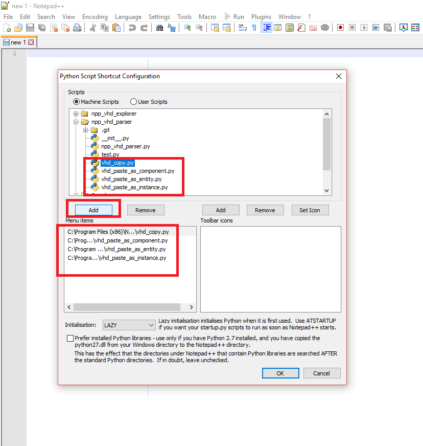
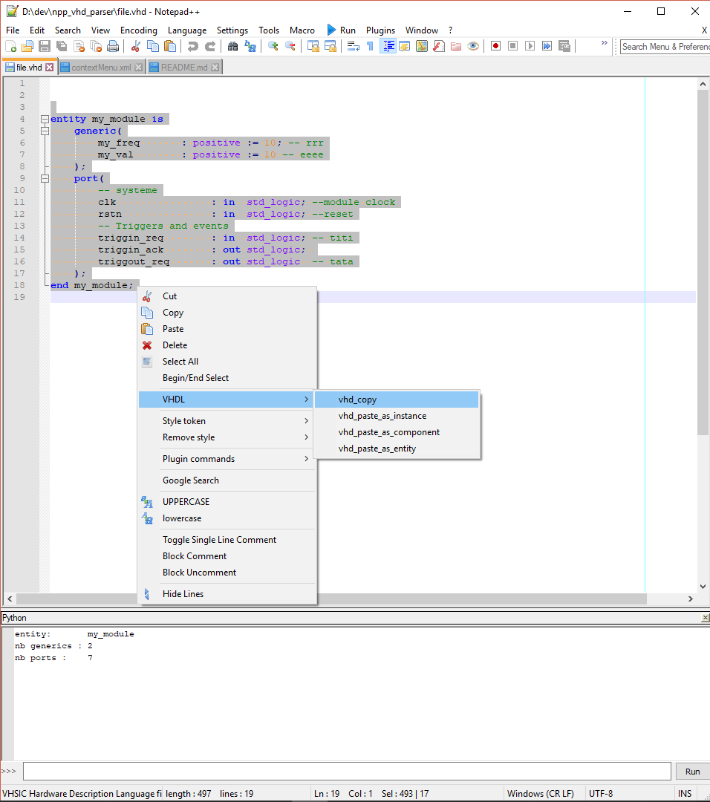

# npp_vhd_parser

npp python script plugin that allows user to manipulate vhdl module. You can copy an entity and paste it as you wish (as a entity, as a component or as an instance)

# installation

- install notepad++ software
- install Python Script for Notepad++
- install this repository in C:\


# How to use

- select an entity in your source code
- start vhd_copy.py script. It will parse your entity.
- go in a new source file
- paste your entity as
	* instance
	* component
	* entity


# Indentation

The default indentation is **3** spaces. It can be tuned in the code.


# Add a shortcut in the context menu 

To add shortcuts to thoses scripts in the context menu: 

- edit Python Script configuration (through its menu). Add in Menu Items our scripts.
  
- edit the context menu ( C:\Users\XXXX\AppData\Roaming\Notepad++\contextMenu.xml ).
 Add folowing lines:


```xml
<Item id="0"/>
<Item FolderName="VHDL" PluginEntryName="Python Script" PluginCommandItemName="vhd_copy" />
<Item FolderName="VHDL" PluginEntryName="Python Script" PluginCommandItemName="vhd_paste_as_instance" />
<Item FolderName="VHDL" PluginEntryName="Python Script" PluginCommandItemName="vhd_paste_as_component" />
<Item FolderName="VHDL" PluginEntryName="Python Script" PluginCommandItemName="vhd_paste_as_entity" />
<Item id="0"/>
```



# Example


## Input

Here is the input vhdl parsed wy the python script

```vhd
entity my_module is
    generic(
        my_freq       : positive := 10; -- rrr
        my_val        : positive := 10 -- eeee
    );
    port(
        -- systeme
        clk                : in  std_logic; --module clock
        rstn               : in  std_logic; --reset
        -- Triggers and events
        sig_in_req        : in  std_logic; -- titi
        sig_in_ack        : out std_logic; 
        sig_out_req       : out std_logic  -- tata
    );
end my_module;
```

## Generated output

### Generated VHD paste as instance

```vhd
my_module_inst:my_module
    generic map(
        my_freq => my_freq,                      -- rrr
        my_val  => my_val                        -- eeee
    )
    port map(
        -- systeme
        clk          => clk,                          --module clock
        rstn         => rstn,                         --reset
        -- Triggers and events
        sig_in_req  => sig_in_req,                  -- titi
        sig_in_ack  => sig_in_ack,
        sig_out_req => sig_out_req                  -- tata
    );
```

###  Generated VHD paste as component

```vhd
component my_module is
    generic(
        my_freq : positive := 10;                                     -- rrr
        my_val  : positive := 10                                      -- eeee
    );
    ports(
        -- systeme
        clk          : in  std_logic;                                                  --module clock
        rstn         : in  std_logic;                                                  --reset
        -- Triggers and events
        sig_in_req  : in  std_logic;                                                  -- titi
        sig_in_ack  : out std_logic;
        sig_out_req : out std_logic                                                   -- tata
    );
end my_module;
```

### Generated VHD paste as entity

```vhd
entity my_module is
    generic(
        my_freq : positive := 10;                           -- rrr
        my_val  : positive := 10                            -- eeee
    );
    ports(
        -- systeme
        clk          : in  std_logic;                              --module clock
        rstn         : in  std_logic;                              --reset
        -- Triggers and events
        sig_in_req  : in  std_logic;                              -- titi
        sig_in_ack  : out std_logic;
        sig_out_req : out std_logic                               -- tata
    );
end my_module;
```
